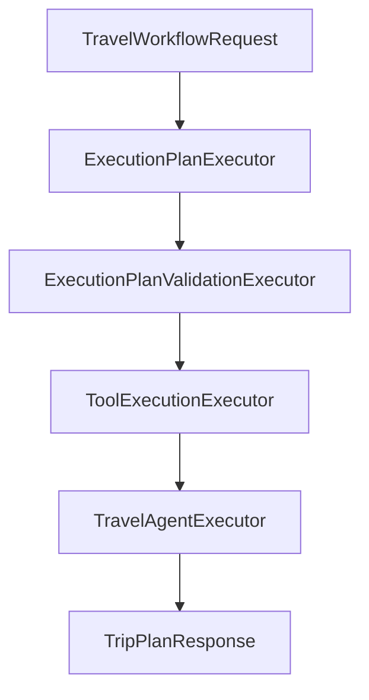
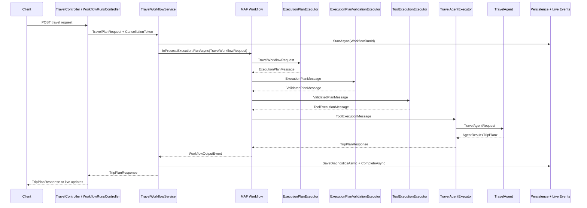

# Chapter 10 — Complete Agent Workflow Execution Flow

This document follows the actual Chapter 10 implementation from the incoming HTTP request to the final `TripPlanResponse`. The important architectural point is that `TravelController` does **not** call each executor. The controller calls `ITravelWorkflowService`, the service runs a native Microsoft Agent Framework (MAF) `Workflow`, and the workflow moves typed messages along the declared executor edges.

```text
Client / Blazor Workflow Explorer
        ↓
TravelController or WorkflowRunsController
        ↓
ITravelWorkflowService
        ↓
TravelWorkflowService
        ↓
TravelPlanningWorkflow
        ↓
Microsoft Agent Framework Workflow
        ↓
ExecutionPlanExecutor
        ↓
ExecutionPlanValidationExecutor
        ↓
ToolExecutionExecutor
        ↓
TravelAgentExecutor
        ↓
TripPlanResponse
```

## 1. Incoming API Request

Chapter 10 exposes two entry points into the same workflow implementation:

| Client style | Endpoint | Behavior |
| --- | --- | --- |
| Synchronous API client | `POST /api/travel/plan` | Waits for the workflow to complete and returns `TripPlanResponse`. |
| Blazor Workflow Explorer | `POST /api/workflow-runs` | Creates and persists a run ID, queues background execution, returns `202 Accepted`, then observes live events over SignalR. |

Both endpoints accept the shared `TravelPlanRequest` contract:

```csharp
public sealed record TravelPlanRequest(
    string Destination,
    int DurationDays,
    string? Preferences = null);
```

A concrete request is:

```json
{
  "destination": "Jaipur",
  "durationDays": 4,
  "preferences": "Use weather for Jaipur, Hyderabad, and Delhi. Include three distance calculations and three currency conversions."
}
```

`TravelController.CreatePlanAsync` validates that `Destination` is not blank and forwards the ASP.NET Core `CancellationToken` to `ITravelWorkflowService.ExecuteAsync`. `TravelWorkflowService.ExecuteAsync` creates a new `Guid` workflow run ID, builds an `OriginalUserRequest` string such as `Plan a 4-day trip to Jaipur. ...`, persists the run envelope through `IWorkflowRunStore.StartAsync`, and then delegates to `ExecuteExistingRunAsync`.

For the live UI, `WorkflowRunsController.StartAsync` performs the same destination validation, creates the same `WorkflowRunId` and original request text, persists the run, and queues `QueuedWorkflowRun`. `WorkflowExecutionBackgroundService` later resolves `ITravelWorkflowService` and calls `ExecuteExistingRunAsync` with that existing run ID. The UI subscribes to `/hubs/workflow-events` and replays persisted events from `GET /api/workflow-runs/{workflowRunId}/events`.

The workflow input message is:

```csharp
public sealed record TravelWorkflowRequest(
    Guid WorkflowRunId,
    TravelPlanRequest Request,
    string OriginalUserRequest);
```

The message carries the correlation key, the validated HTTP request, and the natural-language text used by the classifier and agents.

## 2. Workflow Construction

`TravelPlanningWorkflow` declares the complete topology:

```csharp
public Workflow Create() => new WorkflowBuilder(planning)
    .AddEdge(planning, validation)
    .AddEdge(validation, tools)
    .AddEdge(tools, travelAgent)
    .WithOutputFrom(travelAgent)
    .Build();
```

Actual topology:

```text
ExecutionPlanExecutor
        ↓
ExecutionPlanValidationExecutor
        ↓
ToolExecutionExecutor
        ↓
TravelAgentExecutor
```



This is sequential because the chapter already knows the required phases: plan, validate, execute tools, generate itinerary. The edges are typed by executor generic arguments: `WorkflowExecutor<TInput,TOutput>` derives from MAF `Executor<TInput,TOutput>`. No executor calls the next executor directly. MAF receives the output of one node and routes it to the next node declared by `WorkflowBuilder`.

`TravelWorkflowService` constructs the workflow and runs it in process:

```csharp
Workflow workflow = workflowFactory.Create();
Run run = await InProcessExecution.RunAsync(
    workflow,
    input,
    cancellationToken: cancellationToken);
```

The service then scans the run's `NewEvents` for a `WorkflowOutputEvent` whose `Data` is the final `TripPlanResponse`.

## 3. ExecutionPlanExecutor

`ExecutionPlanExecutor` receives `TravelWorkflowRequest`. Its only business responsibility is to ask `IExecutionPlanProvider` for a candidate `ExecutionPlan`:

```csharp
ExecutionPlan plan = await provider.CreateAsync(
    message.OriginalUserRequest,
    cancellationToken);
```

`ExecutionPlanProvider` delegates to `IRequestClassifier.ClassifyAsync`. The classifier inspects natural-language preferences and produces one `ExecutionStep` for each requested operation. Repeated operations are represented as repeated steps, not as a loop instruction hidden in a tool executor.

For example:

```text
Weather for Jaipur
Weather for Hyderabad
Weather for Delhi
Distance from Hyderabad to Jaipur
Distance from Delhi to Jaipur
Distance from Agra to Jaipur
Convert 500 USD to INR
Convert 300 EUR to INR
Convert 250 GBP to INR
```

becomes:

```text
1. WeatherTool — Jaipur
2. WeatherTool — Hyderabad
3. WeatherTool — Delhi
4. DistanceTool — Hyderabad to Jaipur
5. DistanceTool — Delhi to Jaipur
6. DistanceTool — Agra to Jaipur
7. CurrencyTool — 500 USD to INR
8. CurrencyTool — 300 EUR to INR
9. CurrencyTool — 250 GBP to INR
```

`ToolExecutionExecutor` does not decide how many times to call a tool. It later executes exactly the ordered plan steps it receives. Therefore, three weather calls exist because the execution plan contains three distinct `Weather` steps, each with its own `Order` and arguments.

## 4. ExecutionPlanMessage

`ExecutionPlanExecutor` returns:

```csharp
public sealed record ExecutionPlanMessage(
    Guid WorkflowRunId,
    TravelPlanRequest Request,
    string OriginalUserRequest,
    ExecutionPlan ExecutionPlan);
```

`ExecutionPlan` contains an `Intent` and ordered `ExecutionStep` records. Each `ExecutionStep` contains `Order`, `Tool`, and an argument dictionary.

Simplified example:

```json
{
  "intent": "TravelPlanning",
  "steps": [
    {
      "order": 1,
      "tool": "Weather",
      "arguments": { "city": "Jaipur" }
    },
    {
      "order": 2,
      "tool": "Weather",
      "arguments": { "city": "Hyderabad" }
    }
  ]
}
```

This message is a candidate plan. It may contain invalid or non-canonical arguments and must not be trusted by tools until validation succeeds.

## 5. ExecutionPlanValidationExecutor

`ExecutionPlanValidationExecutor` receives `ExecutionPlanMessage`, validates it with `ExecutionPlanValidator`, optionally invokes `IExecutionPlanRepairAgent`, validates the repaired plan, records validation telemetry, and returns `ValidatedPlanMessage`.

Actual order in the current implementation:

```text
Generated plan
    ↓
Validation
    ↓
Repair agent only when invalid
    ↓
Validation again
```

The validator checks deterministic rules: step orders must be `1..N`, `Weather` requires `destination`, `Distance` requires `origin` and `destination`, `Currency` requires non-negative numeric `amount`, `from`, and `to`, and `LocalTime` requires `city`.

A common model alias issue is:

```text
city → destination
```

For weather steps, `city=Jaipur` is invalid because `WeatherTool` is routed with a canonical `destination` key. The Chapter 10 validator detects this; the repair agent can return a corrected complete plan. Repeated invalid steps are handled independently because every step has its own argument dictionary:

```text
Step 1 Weather city=Jaipur
Step 2 Weather city=Hyderabad
```

must become:

```text
Step 1 Weather destination=Jaipur
Step 2 Weather destination=Hyderabad
```

The book text should call out a design lesson: known aliases such as `city` for weather destination are good candidates for future deterministic normalization before validation. In the current code, that normalization is not implemented; invalid aliases go through the one repair attempt.

## 6. Repair Agent

`ExecutionPlanRepairAgent` is nested inside the validation stage. It is not a workflow executor and does not appear as a separate MAF workflow node.

The repair agent receives:

* original request text;
* invalid `ExecutionPlan`;
* validation error list.

Its system instructions require a complete corrected `ExecutionPlan`, canonical keys (`destination`, `origin`, `amount`, `from`, `to`, and `city`), preserved order, no tool execution, and no invented values. `ExecutionPlanValidationExecutor` attempts repair once. If repair throws, the workflow fails with `RequestClassificationException`. If the repaired plan remains invalid, the workflow fails with a message containing the final validation errors.

Unlimited repair loops are avoided because repeated model repair can hide defects, increase latency/cost, and make workflow behavior hard to reason about. One constrained repair creates an explicit, observable failure boundary.

## 7. ValidatedPlanMessage

`ValidatedPlanMessage` contains:

```csharp
public sealed record ValidatedPlanMessage(
    Guid WorkflowRunId,
    TravelPlanRequest Request,
    string OriginalUserRequest,
    ExecutionPlan ExecutionPlan,
    ExecutionPlanValidationResult InitialValidation,
    ExecutionPlanValidationResult FinalValidation,
    bool Repaired);
```

What changed from `ExecutionPlanMessage`:

| Field | Before | After |
| --- | --- | --- |
| `WorkflowRunId`, `Request`, `OriginalUserRequest` | Carried by `ExecutionPlanMessage` | Carried forward unchanged. |
| `ExecutionPlan` | Candidate classifier output | Original plan if valid; repaired plan if repair was needed and valid. |
| Validation results | Not present | Initial and final validation results are present. |
| Repair flag | Not present | `Repaired` records whether the repair agent was invoked. |

Before/after example:

```text
Before: Step 1 Weather arguments { city: Jaipur }
After:  Step 1 Weather arguments { destination: Jaipur }, Repaired=true
```

Execution trace data records initial validation success/errors, repair timestamps and plan when applicable, final validation success/errors, and later tool execution duration.

## 8. ToolExecutionExecutor

`ToolExecutionExecutor` receives `ValidatedPlanMessage`. It orders the validated steps, routes each step, executes it through the pipeline, records success or failure as `ToolStepResult`, and returns `ToolExecutionMessage`.

Pseudocode matching the implementation:

```csharp
foreach (ExecutionStep step in message.ExecutionPlan.Steps.OrderBy(step => step.Order))
{
    cancellationToken.ThrowIfCancellationRequested();
    ToolRouteDecision route = router.Route(step);

    try
    {
        object? output = await pipeline.ExecuteAsync(route, cancellationToken);
        results.Add(new(step.Order, step.Tool, "Success", output, null));
    }
    catch (ToolExecutionFailedException exception)
    {
        results.Add(new(step.Order, step.Tool, "Failure", null, exception.Message));
    }
}
```

This executor does not invent, merge, remove, or batch steps. A deterministic tool failure is captured as a failed `ToolStepResult` and the loop continues. Request cancellation is different: it is rethrown and stops the workflow.

## 9. ToolRouter and ToolExecutionPipeline

```text
ToolRouter
    → maps a validated plan step to a concrete tool and canonical arguments

ToolExecutionPipeline
    → invokes the tool with timeout, retry, tracing, and status
```

`ToolRouter.Route` maps `ToolType` to concrete tool names:

| Plan tool | Concrete tool | Required arguments |
| --- | --- | --- |
| `Weather` | `WeatherTool` | `destination` |
| `Distance` | `DistanceTool` | `origin`, `destination` |
| `Currency` | `CurrencyTool` | `amount`, `from`, `to` |
| `LocalTime` | `TimeZoneTool` | `city` |

`ToolExecutionPipeline.ExecuteAsync` requires a mandatory route, applies `ToolExecutionOptions.TimeoutSeconds`, retries `TransientToolException` up to `MaximumRetries`, records trace fields, and invokes the selected tool deterministically. Trace data includes tool name, invocation mode, plan step order, input, output, duration, retry count, timeout flag, status, and error.

Repeated tool execution is just repeated routing and pipeline execution with different arguments:

```text
WeatherTool { destination: Jaipur }
WeatherTool { destination: Hyderabad }
DistanceTool { origin: Hyderabad, destination: Jaipur }
CurrencyTool { amount: 500, from: USD, to: INR }
```

## 10. ToolExecutionMessage

After all planned tool steps have been attempted, the executor returns:

```csharp
public sealed record ToolExecutionMessage(
    Guid WorkflowRunId,
    TravelPlanRequest Request,
    string OriginalUserRequest,
    ExecutionPlan ExecutionPlan,
    ExecutionPlanValidationResult Validation,
    bool Repaired,
    IReadOnlyList<ToolStepResult> ToolResults);
```

It carries the original request, validated/repaired execution plan, final validation result, repair flag, and every ordered `ToolStepResult`:

```text
WeatherTool — Jaipur — Success
WeatherTool — Hyderabad — Success
DistanceTool — Hyderabad to Jaipur — Success
CurrencyTool — 500 USD to INR — Success
```

These results are aggregated and passed to the final Travel Agent. Context-provider traces are captured separately by the execution trace recorder when context providers run inside the MAF agent call.

## 11. TravelAgentExecutor

`TravelAgentExecutor` receives `ToolExecutionMessage`, builds a `TravelAgentRequest`, publishes Travel Agent lifecycle events, invokes `ITravelAgent.ExecuteAsync`, records agent execution metadata, and returns the workflow output.

```csharp
TravelAgentRequest request = new(
    message.OriginalUserRequest,
    message.Request,
    message.ToolResults,
    RuntimeContext: null,
    TravelerContext: null);

AgentResult<TripPlan> result = await travelAgent.ExecuteAsync(request, cancellationToken);
```

`TravelAgentExecutor` does not execute tools. Tool execution is already complete. Its job is to pass original request text, the typed travel request, completed tool results, and optional context fields to the agent, then convert a successful `AgentResult<TripPlan>` into `TripPlanResponse`.

## 12. Travel Agent

The agent response pipeline is:

```text
TravelAgentRequest
    ↓
MAF AgentResponse<TripPlan>
    ↓
Structured deserialization
    ↓
Safe raw JSON recovery when structured read fails
    ↓
Deterministic validation
    ↓
Optional regeneration attempt
    ↓
AgentResult<TripPlan>
```

The current code asks MAF for `AgentResponse<TripPlan>` directly, not `AgentResponse<TravelPlanDraft>`. `AgentResponse<T>` is the MAF SDK response returned by `_agent.RunAsync<T>`. It remains inside `TravelAgent`. `AgentResult<T>` is the application-level success/failure envelope returned to workflow code. It contains either `Value` or `Failure`, plus safe `AgentExecutionMetadata`.

Typed agent output is still untrusted. `TravelAgent.ReadStructuredResult` catches `JsonException`, tries safe raw JSON recovery, and otherwise creates a structured-output failure. `TravelAgent.IsValid` checks destination, duration range, requested duration match, day count, sequential day numbers, and non-empty activities. The agent may run up to two attempts (`MaximumAttempts = 2`) when the failure policy says regeneration is appropriate. Cancellation is propagated with normal `OperationCanceledException` flow.

## 13. Final TripPlanResponse

The final output is:

```csharp
public sealed record TripPlanResponse(
    TripPlan TripPlan,
    ExecutionTrace Execution,
    WorkflowExecutionTrace? Workflow = null);
```

It contains the generated `TripPlan`, execution trace, workflow trace, tool calls, context-provider traces, execution-plan trace, and `WorkflowRunId` inside `WorkflowExecutionTrace`.

`TravelAgentExecutor` creates the response with the current execution trace:

```csharp
return new TripPlanResponse(result.Value!, toolTraceRecorder.CaptureCurrent());
```

`TravelWorkflowService.ExtractResponse` retrieves the typed output from the MAF run:

```csharp
foreach (WorkflowEvent workflowEvent in run.NewEvents)
{
    if (workflowEvent is WorkflowOutputEvent { Data: TripPlanResponse result })
    {
        response = result;
    }
}
```

The service persists diagnostics, marks the run completed, publishes final live events, and returns `response with { Workflow = workflowTrace }`.

## 14. Workflow Events

Live event flow:

```text
MAF Workflow
    ↓
Workflow events and executor boundaries
    ↓
Application event bridge
    ↓
Persistence
    ↓
SignalR
    ↓
Blazor Workflow Explorer
```

The code publishes application-specific `WorkflowLiveEventType` values, including `WorkflowStarted`, `ExecutorWaiting`, `ExecutorStarted`, `ExecutorCompleted`, `ExecutorFailed`, `AgentStarted`, `AgentCompleted`, `AgentFailed`, `ToolStarted`, `ToolCompleted`, `ToolFailed`, `MessageProduced`, `WorkflowCompleted`, `WorkflowFailed`, and `WorkflowCancelled`. The enum also contains more granular agent and tool events (`AgentStructuredResponseReceived`, `AgentDeserializationFailed`, `AgentValidationFailed`, `AgentRecoveryStarted`, `AgentRecoveryCompleted`, `AgentRegenerationStarted`, `AgentRegenerationCompleted`, `AgentStreaming`, `ToolRetried`, context-provider started/completed) for the UI contract, although not all are emitted by the current workflow path.

Native MAF events are the framework events collected in `Run.NewEvents`, especially `WorkflowOutputEvent`. Application events are safe DTOs created by `IWorkflowLiveEventPublisher`. Persisted traces are EF Core diagnostic rows. SignalR delivery is the live transport; persisted `WorkflowLiveEvents` remain the replay source of truth.

## 15. Persistence

The actual EF Core `WorkflowDbContext` exposes these tables:

| Table | Stored data | Correlation key | Why needed / UI usage |
| --- | --- | --- | --- |
| `WorkflowRuns` | Run envelope, destination, duration, original request, status, timings, repair flag, failure, optional final trip plan JSON. | `WorkflowRunId` | Identifies and summarizes the complete execution. |
| `AgentExecutions` | Agent executor name, agent name, response type, success/failure fields, attempts, structured-output and regeneration metadata. | `WorkflowRunId` | Shows Travel Agent outcome and safe failure metadata. |
| `WorkflowLiveEvents` | Ordered live event DTO fields and safe data JSON. | `WorkflowRunId`, `Sequence` | Replays live UI state after reconnect or page load. |
| `ExecutorTraces` | Executor order, name, input/output message types, timestamps, duration, status, exception. | `WorkflowRunId` | Shows stage timing and where workflow execution stopped. |
| `MessageTransitions` | Safe summaries of carried-forward, added, and changed message data. | `WorkflowRunId` | Explains typed message flow without storing internal messages. |
| `ToolTraces` | Tool name, invocation mode, plan step order, input/output JSON, timings, status, retries, timeout, errors. | `WorkflowRunId` | Displays individual tool calls and repeated invocations. |
| `ContextProviderTraces` | Provider name, category, duration, context-added flag, status, safe summary. | `WorkflowRunId` | Shows runtime/traveler context contributions without private data. |
| `ExecutionPlans` | Initial plan JSON, validation errors, repair flag, repaired/generated plan JSON, final validation result. | `WorkflowRunId` | Shows classification, validation, and repair diagnostics. |

`WorkflowRunId` is the correlation key tying every table to one end-to-end workflow run.

## 16. Message Transitions

Full typed chain:

```text
TravelWorkflowRequest
    ↓
ExecutionPlanMessage
    ↓
ValidatedPlanMessage
    ↓
ToolExecutionMessage
    ↓
TripPlanResponse
```

| Transition | Carried forward | Added | Changed | Removed |
| --- | --- | --- | --- | --- |
| `TravelWorkflowRequest` → `ExecutionPlanMessage` | `WorkflowRunId`, `TravelPlanRequest`, `OriginalUserRequest` | Candidate `ExecutionPlan` | None | None |
| `ExecutionPlanMessage` → `ValidatedPlanMessage` | Run ID, request, original text | `InitialValidation`, `FinalValidation`, `Repaired` | `ExecutionPlan` may become repaired plan | Unvalidated-only interpretation of plan |
| `ValidatedPlanMessage` → `ToolExecutionMessage` | Run ID, request, original text, validated plan, repair flag | Ordered `ToolResults` | Validation collapses to final `Validation` field | Initial validation details are not on this message |
| `ToolExecutionMessage` → `TripPlanResponse` | Request facts are represented in generated `TripPlan` and traces | `TripPlan`, `ExecutionTrace`, `WorkflowExecutionTrace` | Tool results become prompt inputs and trace entries | Internal workflow messages are not returned |

## 17. Failure Flow

Generic failure flow:

```text
Executor starts
    ↓
Operation fails
    ↓
Failure classified or exception captured
    ↓
Trace persisted when available
    ↓
Live failure event published
    ↓
Workflow stops when exception escapes
    ↓
Workflow marked Failed or Cancelled
```

Stage behavior:

* Classifier failure: `ExecutionPlanExecutor` lets the exception escape; base `WorkflowExecutor` records executor failure and publishes `ExecutorFailed`; service marks workflow failed.
* Invalid execution plan: validation errors are expected data. The validation executor attempts one repair.
* Repair failure: repair exception becomes `RequestClassificationException`; the workflow fails.
* Repaired plan still invalid: validation executor throws `RequestClassificationException` with final errors.
* Tool timeout: pipeline records status `Timeout` and throws `ToolExecutionFailedException`; tool executor records a failed `ToolStepResult` and continues.
* Tool retry: transient tool exceptions increment retry count inside the pipeline before final success/failure trace.
* Permanent tool failure: pipeline records failure; tool executor publishes `ToolFailed`, stores failure result, and continues so the itinerary can acknowledge missing data.
* Travel Agent malformed output: `TravelAgent` creates structured-output failure and may regenerate once.
* Travel Agent validation failure: deterministic validation creates `AgentFailure`; regeneration may happen once; final failure causes `AgentExecutionException` and workflow failure.
* Cancellation: cancellation token is passed through service, MAF run, executors, classifier/repair, tools, and agent; `OperationCanceledException` marks the run cancelled.
* Infrastructure failure: unexpected exceptions escape to `TravelWorkflowService`, partial diagnostics are persisted when available, and the run is marked failed.

Expected failures are represented as validation results, `ToolStepResult` failures, or `AgentFailure` values until a workflow boundary decides to stop. Unexpected defects and cancellation use .NET exception flow.

## 18. Why Not Magentic Here

```text
Known steps and fixed order
    → Sequential Workflow

Unknown next specialist and adaptive replanning
    → Magentic Orchestration
```

Chapter 10 already knows its stages:

```text
Plan
Validate
Execute Tools
Generate Itinerary
```

A Magentic manager would add unnecessary complexity because no runtime agent needs to choose the next specialist or decide whether the work is complete. Magentic orchestration is more appropriate for a later chapter where a manager agent dynamically chooses specialists, replans, and determines completion.

## 19. End-to-End Example

Request:

```json
{
  "destination": "Jaipur",
  "durationDays": 4,
  "preferences": "Use the weather for Jaipur, Hyderabad, and Delhi. Include the distance from Hyderabad to Jaipur, Delhi to Jaipur, and Agra to Jaipur. Convert 500 USD to INR, 300 EUR to INR, and 250 GBP to INR."
}
```

Walkthrough:

1. API request is received by `POST /api/travel/plan` or the live UI starts `POST /api/workflow-runs`.
2. A `WorkflowRunId` is created and `WorkflowRuns` receives the running envelope.
3. `TravelWorkflowRequest` enters the MAF workflow.
4. `ExecutionPlanExecutor` asks the plan provider/classifier for an `ExecutionPlan`.
5. Nine ordered steps are created: three weather, three distance, three currency.
6. `ExecutionPlanValidationExecutor` validates the plan and performs one repair only if needed.
7. Weather aliases such as `city` must become canonical `destination`; current code relies on repair for that case.
8. `ToolExecutionExecutor` executes all nine validated steps in order.
9. `ToolExecutionMessage` aggregates all tool results.
10. `TravelAgentExecutor` invokes `TravelAgent` with original request, typed request, and tool results.
11. `TravelAgent` returns an application `AgentResult<TripPlan>` after structured reading and validation.
12. `TripPlanResponse` is published as the MAF workflow output.
13. Diagnostics are persisted and live events update the Blazor Workflow Explorer.



## 20. Key Lessons

* MAF Workflow owns sequencing.
* Executors encapsulate one workflow stage.
* Typed messages carry accumulated workflow state.
* The execution plan decides repeated tool calls.
* Validation is deterministic and explicit.
* The repair agent is used only inside validation.
* Tools execute validated operations; they do not plan.
* The Travel Agent generates the itinerary; it does not execute tools.
* Agent outputs are still validated even when typed.
* Failures are explicit and observable.
* Workflow events make execution visible while the run is active.
* Persistence enables replay, diagnostics, and comparison.
